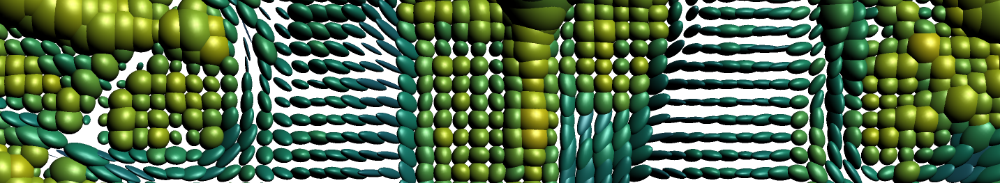

# Manifold-valued Image Restoration Toolbox

A subset of the [Camino Toolkit](http://camino.cs.ucl.ac.uk) Human Head DT-MRI data set using the [viridis](http://bids.github.io/colormap/) colormap.

maintained by  
[Ronny Bergmann](imagepro/members/bergmann/)

written by  
[Ronny Bergmann](http://www.mathematik.uni-kl.de/imagepro/members/bergmann/)  
[Johannes Persch](http://www.mathematik.uni-kl.de/imagepro/members/persch/)

## Introduction

In many application data is nonlinear, i.e. restricted in a certain range and equipped with a different distance measure. For example measuring angles in InSAR imaging or when working on the phase of complex valued wavelets. Other applications include denoising in several color spaces like RGB, HSV and CB. These data live on the circle \(\mathbb S^1\), the sphere \(\mathbb S^2\) and vector spaces of combined real valued and phase valued data \((\mathbb S^1)^m\times\mathbb R^n\). Furthermore, in Diffusion Tensor Imaging (DTI) every data item of an image is given by an \(r\times r\) symmetric positive definite matrix, i.e. from the space \(\mathrm{Sym}(r)\). Often, all these data are obstructed by noise due to measurement or data transfer.

All mentioned spaces are (products of) manifold(s). A very common model for denoising is the well known ROF-model of TV denoising, which was recently generalised to manifolds and has several generalisations itself to overcome the well known stair casing effect.

This package provides an easy-to-use Toolbox for processing manifold valued data. Several examples illustrate and explain the usage of the Toolbox.

## How to use/cite the Toolbox

You can get started by downloading the source code here and just start one of the examples.

If you are using the toolbox, it would be nice, if you give us a note. The Toolbox is available under the [GPL 3 license]( http://www.gnu.org/licenses/gpl.txt), so you can use as long as you stick to the terms of that license. If you're using the software for scientific works, please cite

M. Bačák, R. Bergmann, G. Steidl, A. Weinmann (2016).  
**A second order non-smooth variational model for restoring manifold-valued images.**  
_SIAM Journal on Scientific Computing_. **38**, (1), A567–A597\.  
[[doi]](http://dx.doi.org/10.1137/15M101988X) [[www]](http://arxiv.org/pdf/1506.02409v2.pdf)

or one of the papers below if you're referring to a special example from one of the papers.

## Contents of the Toolbox

### Manifolds

While the algorithms are able to cope with a general manifold as long as it provides a few functions (for example the `log`arithmic, `exp`onential and involved `prox`imal maps), the specific manifolds itself are able to employ `mex`-files, i.e. several functions are written in a vectorial form in C++. The C++ code is also included and the initialisation script `initMVIRT.m` can be used to compile these to your needs (by calling it with the option `'Make'` set to `true`). Furthermore all manifolds still have the Matlab-Implementation as a fallback by setting `M.useMex = false` for a `manifold` object `M` (e.g. if the C++ code does not compile on your machine).

*   the Spheres \(\mathbb S^n\), \(n\in\mathbb N\), especially a class for phase valued data, the \(\mathbb S^1\)
*   the space of \(r\times r\) symmetric positive definite matrices, \(r\in\mathbb R\)
*   the product manifold of combined vector space and phase valued components, \((\mathbb S^1)^m\times\mathbb R^n\), \(n,m\in\mathbb N\)

### Algorithms

An implementation minimizing a model of first and second order differences, i.e. for given Data \(f\) \[\mathrm{arg\,min}_{u} F(u;f) + \alpha\mathrm{TV}(u) + \beta\mathrm{TV}_2(u),\] where \(F\) is the data fidelity term. The minimization includes

*   weightening the first and second order differences, even their horizontal, vertical and/or diagonal, and mixed differences by \(\alpha= (\alpha_1,\alpha_2,\alpha_3,\alpha_4)\) and \(\beta=(\beta_1,\beta_2,\beta_3)\).
*   fast computation by employing an efficient splitting of the functional for the cyclic proximal point algorithm (CPPA)
*   inpaint missing data by specifying an unknown data mask
*   fixing data items by constraints, i.e. specifying a regularisation mask
*   specify convergence criteria
    *   for the subgradient method inside the second order differences as number of steps
    *   for the CPPA a number of maximal iterations or a lower bound \(\epsilon\) for the maximal movement of the data items in \(u\)

Another algorithm models tangential Gaussian noise and employes a patch based approximation of means and variances of the local noise to denoise manifold-valued images.

### Visualisation

The following visualizations are available for different export formats

*   plot \(\mathbb S^2\)-valued data on the sphere (<link http:="" asymptote.sourceforge.net="" -="" external-link-new-window="" "opens="" external="" link="" in="" new="" window"="">Asymptote, Matlab)
*   plot \(\mathbb S^2\)-valued images as vector fields encoding elevation in color (Asymptote)
*   plot \(\mathrm{Sym}(3)\) signals and images as ellipsoids (Asymptote, Matlab, POVRay) using directional encoding, Geodesic Anisotropy Index (GA) or Fractional Anisotropy Index (FA) color coding in any colormap (Asymptote, Matlab)

## Acknowledgements

There are a few people, toolboxes, and data sources, this toolbox owes kudos to, they are in a non-priotising order

*   The co-authors Miroslav Bačák, Friederike Laus, Gabriele Steidl and Andreas Weinmann for all discussions, writing sessions and meetings leading to the theory (see Literature below) all these implementations are built on.
*   The [ManOpt](http://www.manopt.org) toolbox inspired a few function and interface design decisions and is a great toolbox for optimization on manifolds.
*   The [MFOPT](http://www.lellmann.net/work/software/mfopt) Matlab Library also does TV regularization of manifold valued images, though with a different algorithmical approach.
*   The [SSN-Unit](http://www.snnu.uni-saarland.de) for bringing up the need of regularizing phase-valued data which started the project.
*   [UCL Camino Diffusion MRI](http://camino.cs.ucl.ac.uk) Toolkit for providing real life diffusion data and allowing us to provide a small part of that data within one of the examples.
*   The [eigen library](http://eigen.tuxfamily.org/) for their nice C++ matrix-vector classes.
*   The [overwiew of InSAR Interferometry](https://earth.esa.int/workshops/ers97/program-details/speeches/rocca-et-al/) for providing phase valued data of the Mount Vesuvius.

## Literature

The Toolbox includes several examples, namely nearly all examples from the following publications.

*   F. Laus, M. Nikolova, J. Persch, G. Steidl (2017).  
    **A Nonlocal Denoising Algorithm for Manifold-Valued Images Using Second Order Statistics.**
    _SIAM Journal on Imaging Sciences. Accepted._  
    [[www]](http://arxiv.org/abs/1607.08481)
*   M. Bačák, R. Bergmann, G. Steidl, A. Weinmann (2015).  
    **A Second Order Non-Smooth Variational Model for Restoring Manifold-Valued Images.**  
    _SIAM Journal on Scientific Computing._ **38**, (1), A567–A597.  
    [[doi]](http://dx.doi.org/10.1137/15M101988X) [[www]](http://arxiv.org/pdf/1506.02409v2.pdf)
*   R. Bergmann and A. Weinmann (2015).  
    **A Second Order TV-type Approach for Inpainting and Denoising Higher Dimensional Combined Cyclic and Vector Space Data.**  
    _Journal of Mathematical Imaging and Vision_. **55**, (3), 401–427.  
    [[doi]](http://dx.doi.org/10.1007/s10851-015-0627-3) [[www]](http://arxiv.org/pdf/1501.02684v2.pdf)
*   R. Bergmann and A. Weinmann (2015).  
    **Inpainting of cyclic data using first and second order differences.**  
    Tai, X.-C. and Bae, E. and Chan, T. F. and Leung, S. Y. and Lysaker, M. (Eds.) _EMMCVPR 2015_. Springer: 155–168.  
    [[doi]](http://dx.doi.org/10.1007/978-3-319-14612-6_12) [[www]](http://arxiv.org/pdf/1410.1998v1.pdf)
*   R. Bergmann, F. Laus, G. Steidl, A. Weinmann (2014).  
    **Second order differences of cyclic data and applications in variational denoising.**  
    _SIAM Journal on Imaging Sciences_. **7**, (4), 2916–2953.  
    [[doi]](http://dx.doi.org/10.1137/140969993) [[www]](http://arxiv.org/pdf/1405.5349v1.pdf)